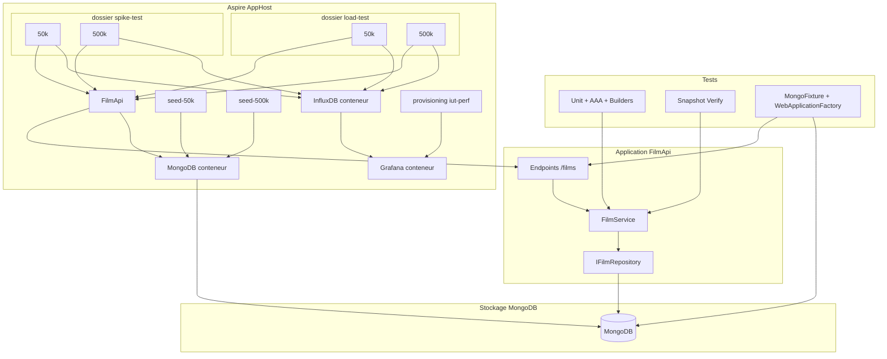

# Plan du TD noté (3h) — Tests et performance

> Ce document est le **plan de conception** du TD noté. Il permet de reprendre la suite dans un autre contexte (référence unique pour le sujet, la structure et les décisions).

---

## Contexte et objectifs

- **Référence :** structure du projet BooksApi (API minimale, Service → Repository), TDs vus en cours (intégration avec Testcontainers, test data builder, snapshot testing, performance avec k6).
- **Livrable :** un sujet de TD noté (squelette de projet optionnel) dans iut-td-note, permettant aux étudiants de pratiquer en 3h les notions vues. **Toutes les explications aux étudiants** (consignes, prérequis, lancement de l’AppHost, seeds, tests de perf, critères de notation, etc.) **doivent figurer dans un README** à la racine du projet.
- **Thème :** **FilmApi** (validé) — même schéma qu’BooksApi (CRUD, pagination) mais avec un modèle **Film** volontairement **imbriqué et complexe** pour mettre en avant les test data builders et le snapshot testing (voir ci-dessous).
- **Base de données :** le projet utilise **uniquement MongoDB** (pas de PostgreSQL) — API, seeds et tests d’intégration.
- **Plateforme :** **.NET 10** ; solution au format **.slnx** (fichier solution XML moderne).

### Modèle Film (objet imbriqué complexe)

Pour justifier pleinement les **test data builders** et le **snapshot testing**, le domaine **Film** est conçu comme un objet riche avec imbrications :

- **Film** : Id, Titre, Résumé, Année, Durée, DateSortie, **Réalisateur** (objet), **Genres** (liste), **Acteurs** (liste d’objets), **PaysProduction** (objet ou liste).
- **Réalisateur** : Id, Nom, Prénom, Nationalité, DateNaissance.
- **Acteur** (dans le film) : Id, Nom, Prénom, Rôle.
- **Genre** : Id, Libellé (ou enum / valeur).
- **Pays** : Code, Nom.

Ainsi, construire un `Film` « à la main » dans un test implique de créer plusieurs objets imbriqués (réalisateur, liste d’acteurs, genres, etc.) — **très verbeux** sans builders. De même, vérifier un DTO de détail de film (ex. réponse `GET /films/{id}`) avec une série d’`Assert.Equal` sur chaque propriété et sous-propriété devient **illisible** ; le **snapshot testing** s’impose pour comparer la structure entière en une assertion.

Le squelette fournira ce modèle (entités + DTOs exposés par l’API) ; les seeds pourront utiliser une version simplifiée (ex. réalisateur et un seul genre par film) pour rester performants à 50k/500k.

---

## 1. Structure du projet à fournir (squelette)

- **Solution :** format **.slnx** (fichier `*.slnx` à la racine), cible **.NET 10** pour tous les projets (API, AppHost, SeedFilms, FilmApi.Tests).

Même organisation que BooksApi, avec un thème « Films » (modèle **Film** imbriqué ci-dessus) et **MongoDB uniquement** :

- **AppHost/** — Aspire : orchestration de l’API + **MongoDB** + seeds + **Grafana** et **InfluxDB** (conteneurs lancés avec l’AppHost, pas de docker-compose séparé).
- **src/FilmApi/** — API ASP.NET Core (minimal API) : endpoints `GET /films`, `GET /films/{id}`, `POST /films` ; modèles **Film** (avec Réalisateur, Acteurs, Genres, etc.), `CreateFilmRequest` (éventuellement simplifié ou imbriqué), `PagedResult<T>` ; `FilmService`, `IFilmRepository` / `FilmRepository` ; persistance **MongoDB** (documents imbriqués ou références selon choix).
- **scripts/SeedFilms/** — application console qui insère N films (50 000 puis 500 000) dans **MongoDB** ; les données seed peuvent être une version allégée du modèle (ex. un réalisateur, un genre) pour garder des temps d’insertion raisonnables.
- **scripts/load-test/** et **scripts/spike-test/** (ou équivalent dans l’AppHost) — dans Aspire, un **dossier load-test** et un **dossier spike-test**, chacun contenant **deux exécutions** : 50k et 500k, qui lancent les tests de performance k6. L’étudiant doit d’abord lancer une seed (50k ou 500k), puis choisir et lancer le test de perf correspondant (voir §5).
- **tests/FilmApi.Tests/** — tests unitaires (service mocké) + tests d’intégration (WebApplicationFactory + **MongoDB** via Testcontainers.MongoDb).

---

## 2. Refacto des tests : pattern AAA

- **Objectif :** Tous les tests (unitaires et intégration) doivent suivre clairement **Arrange / Act / Assert**.
- **État initial (squelette) :** Fournir des tests existants où les commentaires `// Arrange`, `// Act`, `// Assert` sont absents ou mal délimités, ou où une partie du code ne respecte pas le découpage (ex. assertions mélangées avec l’act).
- **Consigne TD :** Refactoriser chaque test pour que :
  - **Arrange** : création des données et des dépendances (mocks, client HTTP, etc.).
  - **Act** : un seul appel métier ou HTTP.
  - **Assert** : uniquement des vérifications (pas d’appels métier).
- **Critères de notation :** lisibilité, séparation nette des trois blocs, pas d’assertion dans l’Act.

---

## 3. Test Data Builders pour les objets du domaine

- **Objectif :** Avec un **Film** imbriqué (Réalisateur, liste d’Acteurs, Genres, etc.), construire des instances en test « à la main » est long et répétitif. Les **builders** permettent de définir des valeurs par défaut et de ne surcharger que ce qui compte pour le test.
- **État initial :** Modèle **Film** complexe et tests qui instancient tout à la main : un `Director`, une liste de `Actor`, une liste de `Genre`, puis le `Film` — nombreuses lignes d’assignations.
- **Consigne TD :**
  - Introduire des builders : **FilmBuilder** (valeurs par défaut, `WithDefaultDirector()`, `WithActors(...)`), **DirectorBuilder** et éventuellement **ActorBuilder**.
  - Au moins **FilmBuilder** avec API fluide : `WithTitle(string)`, `WithYear(int)`, `WithDirector(Director)`, `WithActors(...)`, `WithGenres(...)`, etc.
  - Refactoriser **au moins 3 tests** pour utiliser ces builders au lieu de la construction manuelle.
- **Critères de notation :** API fluide, valeurs par défaut cohérentes, au moins un test avec customisation partielle (ex. seul le titre ou seul le réalisateur change).

---

## 4. Snapshot testing (Verify)

- **Objectif :** Avec un **Film** (et DTO de détail) imbriqué, une vérification propriété par propriété devient illisible et fragile. Le **snapshot testing** permet de comparer la structure entière en une assertion.
- **Simplicité du projet :** **Verify** (Verify.Xunit) est **déjà installé** dans le projet de tests ; les étudiants n’ont pas à ajouter le package. Ils ont **accès à la documentation** de la librairie (ex. [Verify / GitHub](https://github.com/VerifyTests/Verify)) pour l’API et les options (ignore de membres, scoped settings, etc.).
- **État initial :** Au moins un test qui vérifie un DTO complexe (Film avec Réalisateur, Acteurs, Genres) via une longue série d’`Assert.Equal`, et/ou une chaîne formatée comparée à une `expected` en dur.
- **Consigne TD :**
  - Refactoriser **au moins un test** : remplacer les assertions multiples par un snapshot avec Verify (ex. `await Verify(filmDetailDto)`) ; générer le fichier `.verified.`* au premier run. S’appuyer sur la documentation Verify.
  - Si le snapshot contient des données instables (Id, Guid, DateTime), utiliser les paramètres Verify pour **ignorer ou remplacer** ces champs (scoped settings, ignore de membres).
- **Critères de notation :** Au moins un test converti en snapshot sur une sortie « Film complexe » ; snapshot stable ; fichier snapshot versionné ou expliqué dans le README.

---

## 5. Aspire : MongoDB, Grafana, InfluxDB et seeds (50k, 500k)

- **Objectif :** L’AppHost Aspire orchestre tout en un seul lancement : **MongoDB**, l’API FilmApi, **Grafana**, **InfluxDB** et les jobs de seed.
- **Consigne TD :**
  - **MongoDB** : conteneur ou ressource Aspire ; l’API et les seeds s’y connectent.
  - **InfluxDB** : conteneur (`AddContainer`, image `influxdb:2.7-alpine`), port 8086, variables d’environnement (init, token, bucket).
  - **Grafana** : conteneur (image `grafana/grafana`, port 3000), avec **le même provisioning que iut-performance-testing** (dossier `grafana/provisioning` : datasource InfluxDB + dashboard k6 Load Testing).
  - **Seeds** : **seed-50k** et **seed-500k** (démarrage explicite), vidage de la collection films puis insertion par lots dans MongoDB.
  - **Tests de performance depuis Aspire** : workflow obligatoire : **(1)** insérer les données via une **seed** (seed-50k ou seed-500k) ; **(2)** choisir et lancer le test de perf (load ou spike, 50k ou 500k). Dans l’AppHost, deux **dossiers** : **load-test** et **spike-test**. Chaque dossier contient **deux exécutions** : 50k et 500k. Chaque exécution lance le script k6 avec `BASE_URL` (référence FilmApi) et `TOTAL_ITEMS` (50000 ou 500000). Métriques k6 → InfluxDB → Grafana.
  - **README** : workflow (seed puis test de perf), structure dossiers load-test / spike-test (deux exécutions 50k / 500k chacun), consulter les métriques dans Grafana.
- **Critères de notation :** MongoDB, InfluxDB et Grafana démarrés avec l’AppHost ; **workflow respecté** (seed puis test de perf) ; seed-50k et seed-500k fonctionnels ; tests de perf lancés depuis Aspire (dossiers load-test et spike-test) ; métriques visibles dans Grafana.

---

## 6. Tests d’intégration avec MongoDB

- **Objectif :** Les tests d’intégration font tourner l’application avec une base **MongoDB** (driver .NET MongoDB).
- **Consigne TD :**
  - Créer une **MongoFixture** (Testcontainers.MongoDb) : démarrage du conteneur, chaîne de connexion, méthode pour vider la collection des films avant chaque test.
  - Adapter la **WebApplicationFactory** pour que l’API utilise cette connexion MongoDB en tests.
  - Écrire au moins **2 tests d’intégration** : ex. `POST /films` → 201 + film retourné ; `GET /films/{id}` après un POST → 200 avec les bonnes données.
- **Critères de notation :** Conteneur MongoDB partagé (IClassFixture), API lancée avec MongoDB en tests, au moins 2 tests passants (HTTP → Service → MongoDB).

---

## 7. Répartition du temps suggérée (3h)

| Partie | Durée  | Contenu                                                                                                                                                                               |
| ------ | ------ | ------------------------------------------------------------------------------------------------------------------------------------------------------------------------------------- |
| 1      | 20 min | Découverte du squelette, lancement Aspire ; lancer une seed (50k ou 500k), puis un test de perf (dossier load-test ou spike-test, exécution 50k ou 500k) ; visualisation dans Grafana |
| 2      | 35 min | Refacto AAA sur les tests existants                                                                                                                                                   |
| 3      | 40 min | Mise en place des test data builders et refacto d’au moins 3 tests                                                                                                                    |
| 4      | 35 min | Snapshot testing : Verify + au moins un test refactoré (objet ou chaîne)                                                                                                              |
| 5      | 50 min | Tests d’intégration MongoDB : MongoFixture, WebApplicationFactory, 2 tests minimum                                                                                                    |

---

## 8. Livrables à prévoir dans iut-td-note

- **README** (obligatoire) : **toutes les explications aux étudiants** :
  - Prérequis (**.NET 10**, Docker, IDE). Solution au format **.slnx** (ouvrir le fichier `.slnx` ou utiliser `dotnet sln` avec ce fichier).
  - Structure du projet et objectifs du TD (3h).
  - **Workflow tests de performance** : (1) lancer une seed (50k ou 500k) depuis le dashboard Aspire ; (2) lancer le test de performance dans le dossier **load-test** ou **spike-test** (exécution 50k ou 500k). Dossiers **load-test** et **spike-test**, chacun avec deux exécutions (50k, 500k). Consulter les métriques dans Grafana.
  - Consignes par partie (refacto AAA, test data builders, snapshot testing avec Verify — déjà installé, documentation fournie —, tests d’intégration MongoDB) avec critères de notation.
  - Répartition du temps suggérée (tableau 3h).
- **Squelette de solution (optionnel) :** Solution **.NET 10** au format **.slnx** (FilmApi + AppHost + SeedFilms + FilmApi.Tests) avec modèle Film imbriqué, **Verify.Xunit déjà installé**, tests à refactoriser (builders, snapshot). AppHost à compléter (Grafana, InfluxDB) ; tests d’intégration MongoDB à ajouter. Documentation Verify dans le README.

---

## 9. Schéma de dépendances (résumé)

---

## 10. Points à trancher et décisions prises

### Décisions prises

- **Plateforme et solution :** **.NET 10** ; solution au format **.slnx** (fichier solution XML).
- **Thème :** **FilmApi** (validé).
- **Base de données :** MongoDB uniquement (pas de PostgreSQL).
- **Seeds :** 50k et 500k (seed-50k, seed-500k), démarrage explicite depuis le dashboard.
- **Tests de performance :** Workflow : (1) l’étudiant insère les données via une seed (50k ou 500k) ; (2) il choisit puis lance le test de perf (load ou spike, 50k ou 500k). Dans Aspire : deux dossiers **load-test** et **spike-test**, chacun avec deux exécutions (50k, 500k).
- **Grafana :** Dashboard et provisioning repris de iut-performance-testing (dossier `grafana/provisioning`) ; montage ou copie dans le conteneur Grafana du TD.
- **Verify :** Déjà installé dans le projet de tests ; documentation fournie aux étudiants.

