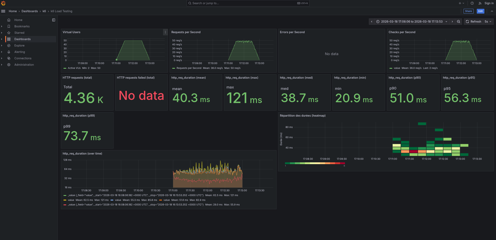

# Rapport — Load test 500k

**Test exécuté** : `task load-500k` (load test, 500 000 films)

## 1. Capture Grafana

_Collez ici une capture d’écran du dashboard Grafana (http://localhost:3000/d/k6-load-testing/k6-load-testing) pendant ou après l’exécution du test._

<!-- Remplacer par votre capture, ex. :  -->

## 2. Observations

_Décrivez ce que vous constatez lors de l’exécution du test (débit, latence, erreurs, comportement du système, etc.)._

**(Note : Test exécuté avec 1 Million de films - voir capture)**

- **Débit (Throughput)** : Pic stable à **50 requêtes/seconde** lors du plateau, avec une moyenne de 36 req/s sur la durée totale (incluant ramp-up/down).
- **Latence (Response Time)** : Claire dégradation par rapport au test 100k (Moyenne 14.5ms → 40.3ms).
  - **Moyenne** : **40.3 ms**
  - **P95** : **56.3 ms**
  - **P99** : **73.7 ms**
  - **Max** : **121 ms**
- **Impact du volume de données** : Le passage de 100k à 1M d'items a multiplié la latence moyenne par presque 3 (x2.7). Cela confirme que la pagination (SKIP) devient plus coûteuse à mesure que la collection grandit.
- **Stabilité** : Malgré le ralentissement, aucune erreur (**0%**) n'est détectée. Le système reste robuste mais moins réactif. 
