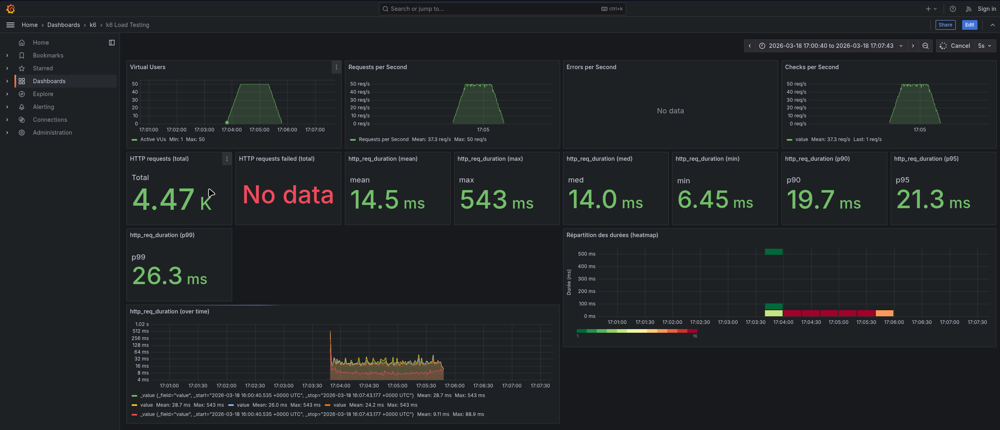

# Rapport — Load test 50k

**Test exécuté** : `task load-50k` (load test, 50 000 films)

## 1. Capture Grafana

_Collez ici une capture d’écran du dashboard Grafana (http://localhost:3000/d/k6-load-testing/k6-load-testing) pendant ou après l’exécution du test._

<!-- Remplacer par votre capture, ex. :  -->

## 2. Observations

_Décrivez ce que vous constatez lors de l’exécution du test (débit, latence, erreurs, comportement du système, etc.)._

**(Note : Test effectué avec 100k films en base au lieu de 50k)**

- **Débit (Throughput)**: Le débit monte progressivement pour se stabiliser autour de **50 requêtes/seconde** (pour 50 VUs), avec une moyenne globale de 37.3 req/s sur la durée du test.
- **Latence**: Excellente performance globale.
  - **Moyenne**: 14.5 ms
  - **P95**: 21.3 ms (95% des requêtes sous 21ms)
  - **P99**: 26.3 ms
  - **Max**: 543 ms (probablement un pic isolé au démarrage ou lors d'une garbage collection)
- **Erreurs**: Aucune erreur (**0%** failure rate), le système est stable.
- **Comportement**: Le système encaisse parfaitement la charge de 50 VUs sur un jeu de données de 100k items sans dégradation notable. 
