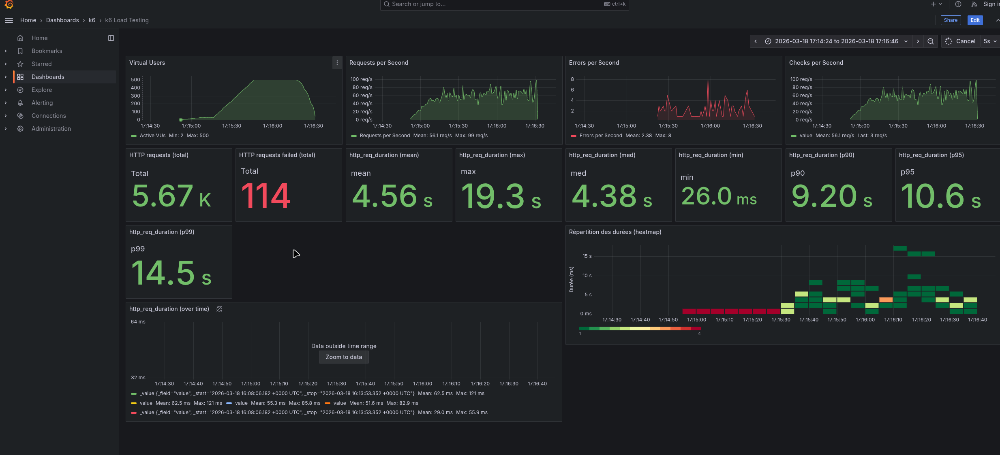

# Rapport — Spike test 500k

**Test exécuté** : `task spike-500k` (spike test, 500 000 films)

## 1. Capture Grafana

_Collez ici une capture d’écran du dashboard Grafana (http://localhost:3000/d/k6-load-testing/k6-load-testing) pendant ou après l’exécution du test._

<!-- Remplacer par votre capture, ex. :  -->

## 2. Observations

_Décrivez ce que vous constatez lors de l’exécution du test (pic de charge, latence, erreurs, dégradation, reprise, etc.)._

**(Note : Test exécuté avec 1 Million de films - voir capture)**

- **Pic de charge (Spike)** : Montée brutale jusqu'à **500 VUs**.
- **Effondrement des performances (Latence)** :
  - La latence explose littéralement : Moyenne à **4.56 secondes** (contre ~40ms en charge stable).
  - P95 à **10.6 s** et Max à **19.3 s**.
  - Le système ne répond plus dans des temps acceptables.
- **Erreurs** : **114 requêtes en échec** (Timeouts ou 5xx). Le système commence à faillir sous la pression.
- **Dégradation** : Le débit (RPS) plafonne et devient instable (~100 req/s max), n'arrivant pas à suivre la montée en charge des utilisateurs virtuels.
- **Conclusion** : Avec 1M d'items, la stratégie actuelle (probablement `Skip/Take` sans index optimisé pour la pagination profonde) ne tient pas la charge d'un pic de 500 utilisateurs. La base de données sature (CPU/IO) pour scanner les documents. 
