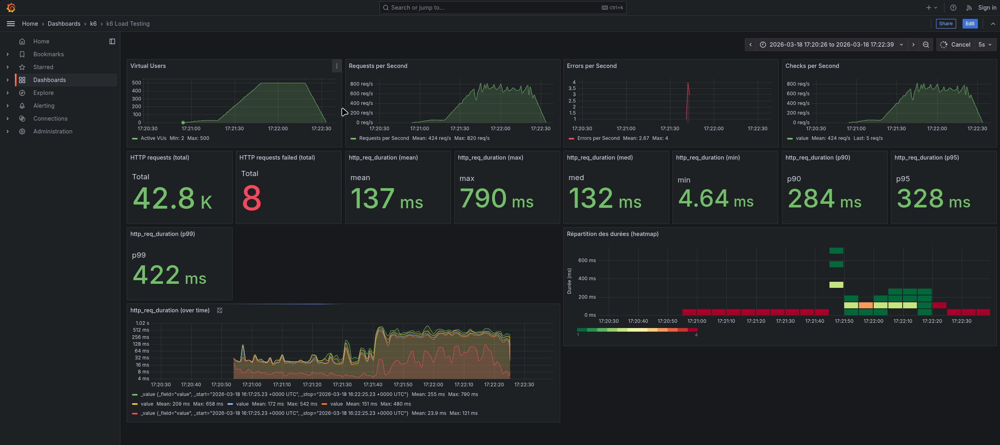

# Rapport — Spike test 50k

**Test exécuté** : `task spike-50k` (spike test, 50 000 films)

## 1. Capture Grafana

_Collez ici une capture d’écran du dashboard Grafana (http://localhost:3000/d/k6-load-testing/k6-load-testing) pendant ou après l’exécution du test._

<!-- Remplacer par votre capture, ex. :  -->

## 2. Observations

_Décrivez ce que vous constatez lors de l’exécution du test (pic de charge, latence, erreurs, dégradation, reprise, etc.)._

**(Note : Test exécuté avec 100k films - voir capture)**

- **Pic de charge (Spike)**: Montée jusqu'à **500 VUs**.
- **Débit (Requests per Second)**: Le débit a atteint un pic impressionnant de **~800 requêtes/seconde**, montrant une bonne capacité d'absorption.
- **Latence (Response Time)**:
  - Augmentation notable mais contrôlée comparé au test 1M.
  - **Moyenne**: **137 ms**.
  - **P95**: **328 ms**.
  - **Max**: **790 ms**.
- **Erreurs**: Très faible taux d'erreur : seulement **8 requêtes en échec** sur un total de 42.8k requêtes.
- **Conclusion**: Le système avec 100k items résiste beaucoup mieux au pic de charge que le test à 1M d'items. La latence augmente (x10 par rapport à la charge normale) mais reste fonctionnelle (< 1s), et le nombre d'erreurs est anecdotique. 
